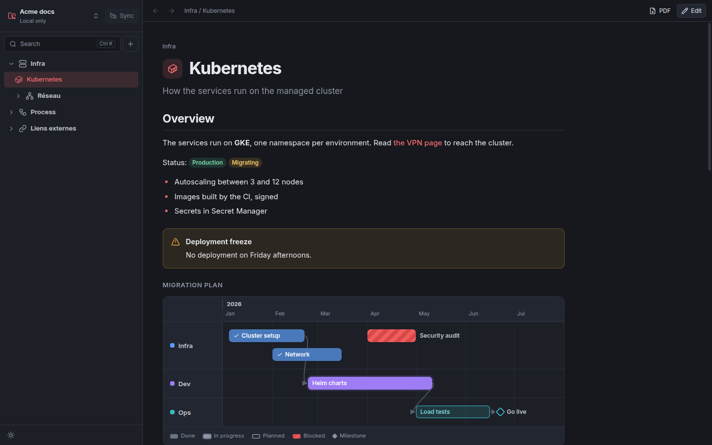

# Spring

Beautiful documentation kept in git, the sibling of [Milka](https://github.com/romainlavabre/milka) and
[Simone](https://github.com/romainlavabre/simone):

- **Unlimited workspaces**, each one a git repository, synchronised on their own (commit, pull, push) with conflict
  resolution.
- **Sections, sub-sections and pages**, plus **external links** in the menu that open in the browser.
- **Pages made of typed blocks**, not just Markdown: prose, callouts, **code with a copy button**, code tabs, **tables
  with typed columns**, **timelines** (a vertical story, or a **Gantt chart** with lanes, milestones and dependencies),
  steps, cards, tabs, collapsible blocks, **Mermaid diagrams** and images.
- **Edit in place**: each block keeps its look while you edit it, with a form fitted to its type (a grid for tables and
  timeline items, a spreadsheet can be pasted).
- **PDF export** of a page, or of a section with a cover and its contents.
- **Search** across every page with Ctrl+K.
- **MCP server** so Claude can write and maintain the documentation, block by block.
- Dark and light themes; updates itself.



## Install

Linux x86_64, with `git` and `openssh-client` (dependencies of the `.deb`).

```bash
curl -fsSL https://raw.githubusercontent.com/romainlavabre/spring/master/install.sh | bash
```

Debian and Ubuntu get the `.deb` package, named `spring-doc` as `spring` is taken in the Ubuntu archive (menu entry and
`spring` command); other distributions get the AppImage unpacked
in `~/.local/share/spring`. `./install.sh --help` lists the options (a given version, a downloaded file, `--from-source`,
`--uninstall`).

Spring then updates itself: when a new release is out, a card offers to install it (the `.deb` asks for your password in
a system window) and to restart.

## Quick start

1. **Create a workspace.** Open the workspace menu at the top of the sidebar, **Add workspace…**, **Create new**. To
   share it, set its git remote from the same menu, or clone your team's repository instead.
2. **Create sections** with the **+** button of the sidebar: Infra, Process, External links…
3. **Add pages and links**: right-click a section, **New page** or **New external link**.
4. **Write**: a new page opens in edit mode. Hover a block to edit, move, duplicate or delete it; the **+** lines between
   blocks insert new ones. **Ctrl+S** saves, and the change is committed and pushed.
5. **Let Claude write**: `claude mcp add spring -- spring mcp`, then ask it to document something.

## Documentation

| Page | What you will find |
|---|---|
| [Workspaces and git sync](docs/workspaces.md) | Create, clone and switch workspaces; what is in them; sync and conflicts |
| [Writing pages](docs/writing.md) | The menu, edit mode, every block type, Markdown, links between pages, images, shortcuts |
| [Timelines](docs/timelines.md) | Vertical stories and Gantt charts: lanes, phases, milestones, statuses, dependencies |
| [PDF export](docs/pdf-export.md) | Exporting a page or a section, from the app or the command line |
| [MCP server](docs/mcp.md) | Letting Claude write the documentation |

## A page is a JSON file

A workspace is a folder of JSON and YAML files in a git repository. The format is made for the app and for assistants
rather than for reading on GitHub, and it is validated on every write:

```json
{
  "title": "Kubernetes",
  "description": "How the services run on the managed cluster",
  "icon": "container",
  "blocks": [
    { "id": "intro", "type": "text", "md": "## Overview\nThe services run on **GKE**." },
    {
      "id": "plan",
      "type": "timeline",
      "view": "gantt",
      "lanes": [
        { "id": "infra", "title": "Infra", "color": "blue" }
      ],
      "items": [
        { "id": "cluster", "title": "Cluster", "kind": "phase", "start": "2026-01", "end": "2026-02", "lane": "infra", "status": "done" },
        { "id": "live", "title": "Go live", "kind": "milestone", "start": "2026-03-02", "lane": "infra", "dependsOn": ["cluster"] }
      ]
    }
  ]
}
```

## Development

```bash
npm install
npm run dev               # the app with hot reload
./run.sh --sandbox        # the same, with a throwaway data folder in .sandbox/
npm run typecheck
npm run lint
npm test                  # unit tests (blocks, storage, search, git sync, updater, MCP, rendering)
npm run test:integration  # the built CLI as an MCP server over stdio, and PDF export by the app binary
npm run test:e2e          # end-to-end tests of the app with Playwright
npm run docs:screenshots  # regenerate the screenshots of docs/images from the demo workspace
npm run dist              # .deb and AppImage in dist/, standalone CLI in out/cli/spring.cjs
./tag.sh                  # publish a release
```

Set `SPRING_DATA_DIR` to use another data folder than `~/.config/spring`. To regenerate the icon after editing
`build/logo.svg`: `npx electron build/render-icon.cjs`.

### Architecture

- `src/core`: pure Node, shared by the app, the CLI and the MCP server: the block schemas (zod) and their validation,
  operations on blocks, the workspace store, search.
- `src/main`: Electron main process: workspaces and git sync, PDF export, images of the workspaces, updates, IPC.
- `src/preload`: typed bridge exposed to the renderer.
- `src/renderer`: React UI. `doc/` renders the blocks (the app and the PDFs share it), `features/editor` edits them.
- `src/cli`, `src/mcp`: command line and MCP server.

## License

MIT
