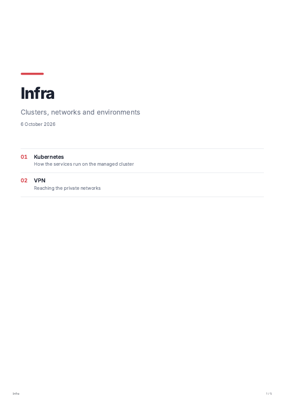
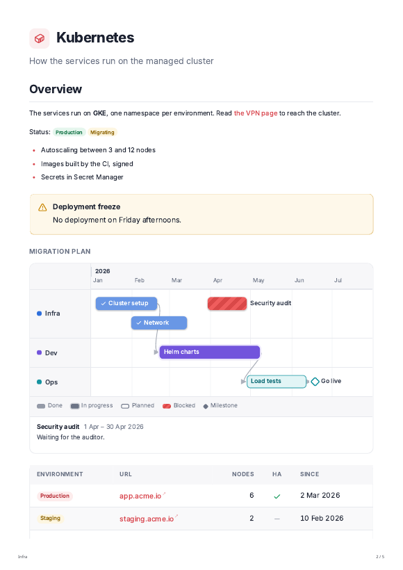

# PDF export

**PDF** at the top right of a page, or **Export as PDF** in the menu of a page or a section, asks where to save the
file (the Downloads folder by default). Once saved, **Open** in the notice opens the PDF in the default viewer, and
**Show in folder** shows it in the file manager.

- A **page** is printed as it reads, in the light theme.
- A **section** starts with a cover (its title, description and the date) and its contents, then every page of the
  section and of its sub-sections, in menu order.
- Tabs, collapsible blocks and every variant of code tabs are unfolded; the descriptions of Gantt items are listed
  under the chart. Pages are A4, numbered in the footer.

 

## From the command line

The `spring` command of the app exports without opening a window:

```bash
spring export infra/kubernetes -o kubernetes.pdf     # a page
spring export infra -o infra.pdf                     # a section
spring export "" -o everything.pdf                   # the whole workspace
```

It works on the workspace of the current folder, or of `--workspace <folder>`.
