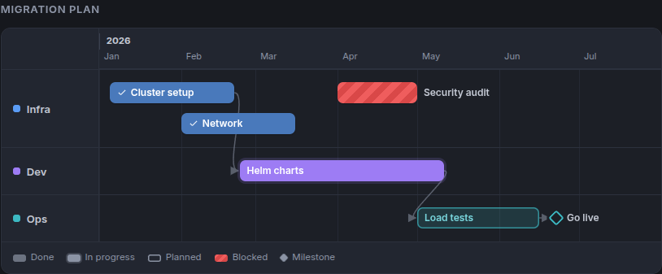
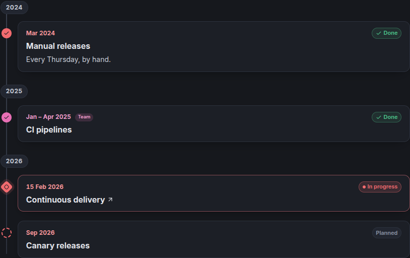

# Timelines

A timeline block shows dated items in one of two views.

## Gantt schedule

Lanes are rows (teams, streams, environments). Phases are bars, milestones are diamonds, events are dots. Arrows show
dependencies, and a dashed line shows today. Hover an item to read its description; click it when it has a link.

## Vertical story

Items in date order, grouped by year: the history of a project, a changelog, a roadmap.

## Items

| Field | |
|---|---|
| Title | What happened, or will |
| Kind | **phase** (from a start to an end), **milestone** or **event** (a point in time) |
| Start, end | `YYYY`, `YYYY-MM` or `YYYY-MM-DD`; a month runs to its last day. Only phases have an end. |
| Lane | Optional: the row of the Gantt view, a colored tag in the vertical view |
| Status | **done**, **current** (in progress), **planned** or **blocked** |
| Description | Markdown, shown under the item, or on hover in the Gantt view (and under the chart in PDFs) |
| Link | A page (`page:section/page`) or a website |
| Depends on | Items that must finish first: arrows in the Gantt view |

The timeline editor lists the lanes (title and color) and the items as a grid; the arrow at the start of a row opens its
description, link and dependencies. The view, a title and the line of today are set above.

A timeline is refused when an item is in an unknown lane, depends on an unknown item or on itself, or ends before it
starts.
