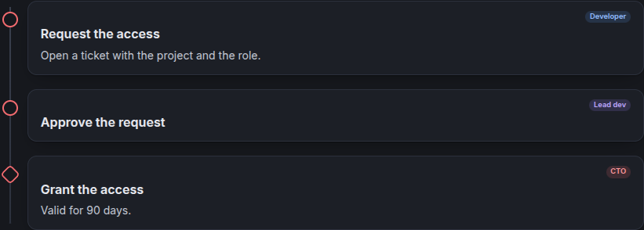

# Timelines

A timeline block shows items, usually dated, in one of two views.

## Gantt schedule

Lanes are rows (teams, streams, environments). Phases are bars, milestones are diamonds, events are dots. Arrows show
dependencies, and a dashed line shows today. Hover an item to read its description; click it when it has a link. Items
without a date have no place on the chart: they are listed under it.


## Vertical story

Items in date order, grouped by year: the history of a project, a changelog, a roadmap. As soon as one item has no
date, the items keep the order they are written in: a procedure, or a plan whose dates are not known yet.


### Procedures

A procedure says who does what, in which order. Give each step an actor, and leave out the dates and the status: the
steps keep their order, and each shows its actor on the right instead of a status pill.

Declare the actors of the block, like lanes, to show them as colored badges: an item whose actor is the id of a
declared actor shows its title in a badge of its color (one of the palette when it has none). Any other actor is free
text, shown as written.

```json
{
  "id": "access",
  "type": "timeline",
  "view": "vertical",
  "actors": [
    { "id": "dev", "title": "Developer", "color": "blue" },
    { "id": "lead", "title": "Lead dev", "color": "violet" },
    { "id": "cto", "title": "CTO", "color": "red" }
  ],
  "items": [
    { "id": "request", "title": "Request the access", "actor": "dev", "description": "Open a ticket with the project and the role." },
    { "id": "approve", "title": "Approve the request", "actor": "lead" },
    { "id": "grant", "title": "Grant the access", "actor": "cto", "kind": "milestone" }
  ]
}
```



## Items

| Field | |
|---|---|
| Title | What happened, or will |
| Kind | **phase** (from a start to an end), **milestone** or **event** (a point in time) |
| Start, end | Optional. `YYYY`, `YYYY-MM` or `YYYY-MM-DD`; a month runs to its last day. Only phases have an end, after a start. |
| Lane | Optional: the row of the Gantt view, a colored tag in the vertical view |
| Actor | Optional: who does it. The id of a declared actor, shown as a colored badge, or free text (`CTO`, `Lead dev`…). Shown on the item, and on hover in the Gantt view. |
| Status | Optional: **done**, **current** (in progress), **planned** or **blocked**. Without status, no pill. |
| Description | Markdown, shown under the item, or on hover in the Gantt view (and under the chart in PDFs) |
| Link | A page (`page:section/page`) or a website |
| Depends on | Items that must finish first: arrows in the Gantt view |

The timeline editor lists the lanes and the actors (title and color) and the items as a grid, where an item picks one of
the actors or takes free text; the arrow at the start of a row opens its
description, link and dependencies. The view, a title and the line of today are set above.

A timeline is refused when two actors share an id, when an item is in an unknown lane, depends on an unknown item or on itself, has an end without
a start, or ends before it starts.
