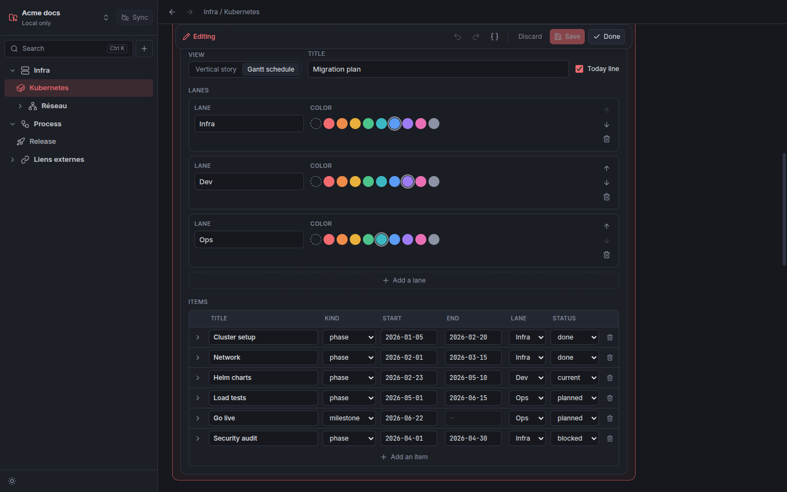
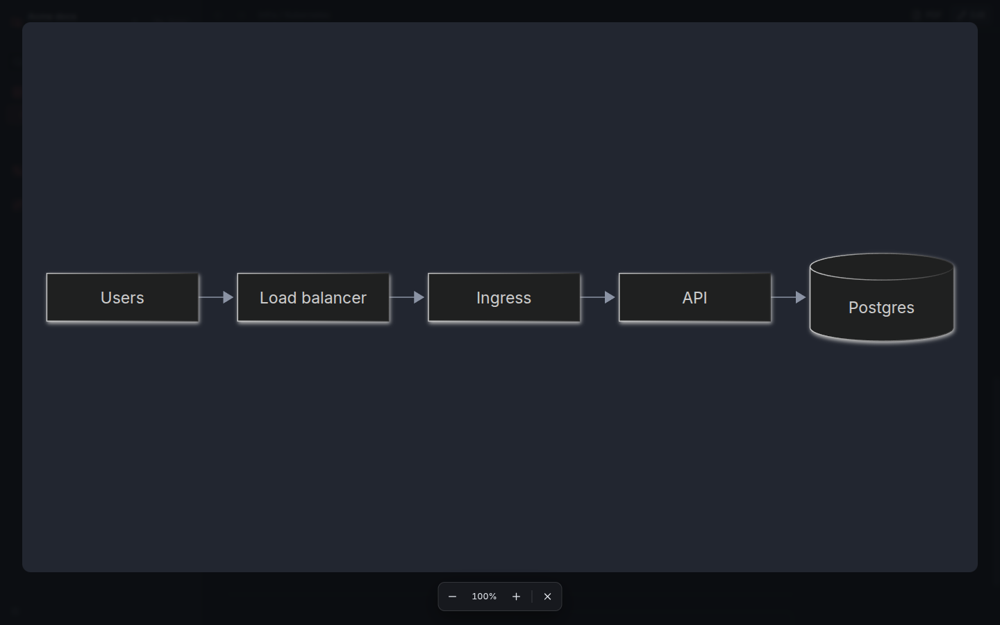
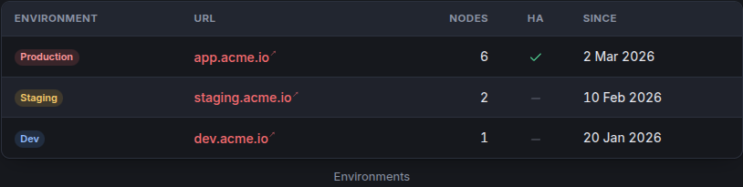
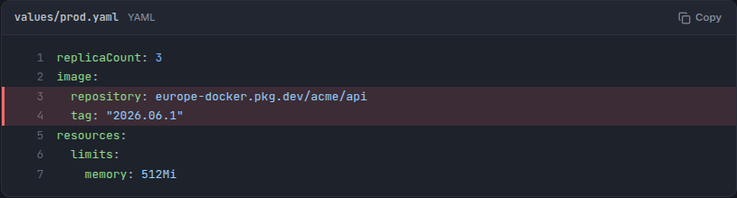

# Writing pages

## The menu

The sidebar shows the sections, pages and external links of the workspace.

- **Click** a section to fold or unfold it, a page to read it, a link to open it in your browser.
- **Right-click** for the actions: new page, section or link inside a section; settings (title, description, icon);
  edit, duplicate or export a page; delete.
- **Drag and drop** to reorder, or to move an item into another section (drop it on the middle of the section). Links
  to a moved page are rewritten in every page.
- **Ctrl+K** searches titles, text, code, tables and timelines of every page.

## Edit mode

**Edit** at the top right of a page (or **Edit** in its menu) shows a toolbar:

- Hover a block: its toolbar lets you **edit** it (or double-click it), move it up or down, **drag** it, duplicate it
  or delete it.
- The **+** lines between blocks insert a block of any type.
- The block keeps its look while you edit it: its form opens below it, and the block follows as you type.
- **Paste or drop an image** anywhere on the page: it is added to the workspace and shown in an image block.
- **Undo** and **redo** (Ctrl+Z, Ctrl+Shift+Z), **Save** (Ctrl+S), **Discard**, **Done**.
- **{ }** shows the JSON of the page, to edit it as text.
- Mistakes are listed above the page (click one to open the block), and the page cannot be saved until they are fixed.

Leaving a page, switching workspace or quitting with unsaved changes asks whether to save them.

## Blocks

| Block | For |
|---|---|
| **Text** | Prose in Markdown. `##` and `###` headings make the table of contents on the right of the page. |
| **Callout** | A colored box: info, tip, success, warning, danger or note, with an optional title. |
| **Code** | Highlighted code with a **Copy** button, a file name, highlighted lines (`2-4,8`) and line numbers. |
| **Code tabs** | The same snippet in several variants (bash, PowerShell, Docker…), one tab each. |
| **Table** | Typed columns: text, Markdown, number, date, badge (colored per value), code, check (✓). Optional caption, grouped headers, stripes. Readers sort by clicking a title. **Paste from a spreadsheet** fills it at once. |
| **Timeline** | A vertical story or a Gantt chart: see [Timelines](timelines.md). |
| **Steps** | A numbered procedure. |
| **Cards** | A grid of cards with an icon, a color and a link to a page or a website. |
| **Tabs** | Blocks grouped under tabs; each tab holds its own blocks. |
| **Collapsible** | Blocks hidden under a summary. |
| **Diagram** | A [Mermaid](https://mermaid.js.org/intro/syntax-reference.html) diagram: flowchart, sequence, entity-relationship, class, state, Gantt… Click to open it in full screen. |
| **Image** | An image of the workspace, small, medium or full width, with a caption. Click to open it in full screen. |
| **Divider** | A horizontal line. |

A diagram or an image opens over the whole window with a click, or with the expand button at its top right corner. The
wheel or `+` and `-` zoom, a drag moves it, a double click zooms where it points, `0` fits it back to the window and
`Escape` closes.

## Markdown

Text blocks, callouts, steps, cards, table columns of type Markdown and timeline descriptions take GitHub-flavored
Markdown: `**bold**`, `*italic*`, `` `code` ``, lists, task lists, quotes, tables, and:

| Write | To get |
|---|---|
| `[the VPN](page:infra/reseau/vpn)` | A link to another page of the workspace |
| `[setup](page:infra/kubernetes#setup)` | A link to a heading of a page |
| `[Grafana](https://grafana.acme.io)` | A link that opens in the browser |
| `:badge[Production]{color=green}` | A colored badge: red, orange, amber, green, teal, blue, violet, pink, gray |
| `:kbd[Ctrl+C]` | A key |

## Icons

Pages, sections, links and cards take a [Lucide](https://lucide.dev/icons/) icon: pick one of the suggestions, or type
any name in kebab-case (`server`, `git-branch`, `shield-check`…).

## Theme

A `theme.css` file at the root of the workspace is applied over the theme, in the app and in the PDFs. The colors of
the pages are CSS variables (`--doc-accent`, `--doc-fg`…) defined in
[`doc.css`](../src/renderer/src/doc/doc.css).
